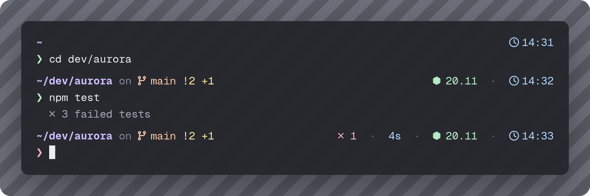
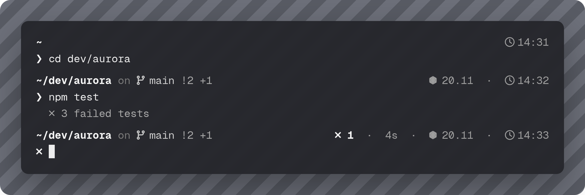
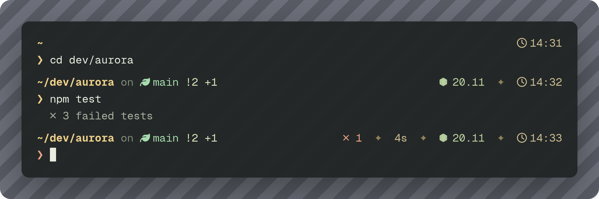

# starship-nerd-theme

A clean, two-line [Starship](https://starship.rs/) prompt built around Nerd Font icons and soft colors.

- **Left:** directory, git branch, git state and status (plus user/host only over SSH or as root)
- **Right:** exit code of failed commands, command duration (over 2s), active language/runtime versions (Node, Bun, Deno, Python, Rust, Go, Java, PHP, C, Docker context) and the current time
- **Prompt line:** a `❯` that changes color when the last command failed

All colors come from a single palette, so you can switch the whole look by changing one line.

## Palettes

### colorful

Pastel tones: lavender, peach and mint.



### minimalist

Grayscale only.



### lotr

Gold and forest greens, inspired by *The Lord of the Rings*.



### Switching palette

Set the `palette` key near the top of `starship.toml`:

```toml
palette = "colorful"   # or "minimalist" or "lotr"
```

Palettes only change colors, not symbols. To match the screenshots exactly, also apply these tweaks:

- **minimalist:** in `[character]`, set `error_symbol = '[✗](bold err)'`
- **lotr:** in `[git_branch]`, set `symbol = ' '`, and replace every `  ·  ` separator with `  ✦  `

## Requirements

- [Starship](https://starship.rs/#quick-install)
- A [Nerd Font](https://www.nerdfonts.com/) installed and selected in your terminal (otherwise the icons show up as boxes)

## Installation

### 1. Install Starship

```sh
curl -sS https://starship.rs/install.sh | sh
```

Or use your package manager (`brew install starship`, `pacman -S starship`, `winget install starship`, ...).

### 2. Install the theme

Back up your current config if you have one, then copy `starship.toml` into place:

```sh
mkdir -p ~/.config
[ -f ~/.config/starship.toml ] && cp ~/.config/starship.toml ~/.config/starship.toml.bak
curl -fsSL https://raw.githubusercontent.com/raccoon-overlord-dev/starship-nerd-theme/main/starship.toml -o ~/.config/starship.toml
```

Or clone the repo and copy the file manually:

```sh
git clone https://github.com/raccoon-overlord-dev/starship-nerd-theme.git
cp starship-nerd-theme/starship.toml ~/.config/starship.toml
```

### 3. Enable Starship in your shell

Skip this step if Starship is already set up.

**Bash**: add to the end of `~/.bashrc`:

```sh
eval "$(starship init bash)"
```

**Zsh**: add to the end of `~/.zshrc`:

```sh
eval "$(starship init zsh)"
```

**Fish**: add to the end of `~/.config/fish/config.fish`:

```fish
starship init fish | source
```

Then restart your terminal (or `source` the file you edited).

## Customization

Everything lives in `starship.toml`. Edit the hex values under `[palettes.*]` to tweak a palette, or add your own `[palettes.mytheme]` block with the same keys (`dir`, `branch`, `gitstat`, `lang`, `time`, `ok`, `err`, `conn`, `sep`) and set `palette = "mytheme"`. See the [Starship configuration docs](https://starship.rs/config/) for all the options.

## License

[MIT](LICENSE): free to use, modify and share.
